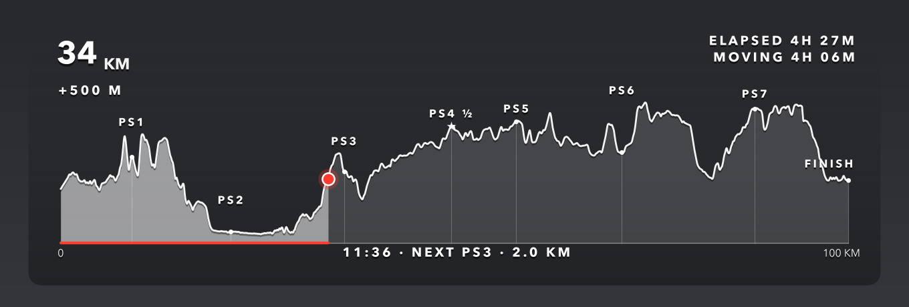

# race-overlay

Elevation-profile **"you are here" overlays for race videos**. Parses your
GPS activity file (.fit / .gpx), draws the course elevation profile with the
event's checkpoints, and renders transparent PNGs showing where on the course
each moment — or each video clip — was filmed. Drop them onto your footage in
DaVinci Resolve (or any NLE); no keying needed. Works for any point-to-point
event: ultras, marathons, bike races.



*The actual PNGs have a fully transparent background — shown here on a dark
backdrop.*

Each overlay shows:

- the full course elevation profile (completed part emphasized, remaining
  part translucent) with checkpoint markers
- a "you are here" dot + progress bar
- distance covered, elevation gained
- clock time, elapsed time, moving time
- distance to the next checkpoint

All stats are computed for the exact position/moment of the overlay.

## Setup

Python 3.11+:

```bash
python -m venv .venv
.venv/bin/pip install -r requirements.txt
```

Describe your event in `event.toml` (checkpoint names + official kms, course
length, timezone) — the committed file is a fully documented example.

## Usage

**One overlay per video clip** (the main workflow) — reads each clip's
recording timestamp from its metadata and maps it onto your track:

```bash
python gopro_batch.py my_run.fit /path/to/clips extra_clip.MOV
```

Accepts folders and/or individual `.MP4`/`.MOV` files. iPhone footage carries
its own timezone; for GoPro-style cameras set `camera.utc_offset_hours` in
`event.toml` to whatever timezone the camera clock was set to.

**Overlays for arbitrary positions** — km values, clock times, or a batch
file:

```bash
python race_overlay.py my_run.fit --km 34 57.5 88
python race_overlay.py my_run.fit --ts 09:30 --ts 14:02:30
python race_overlay.py my_run.fit --pos-file positions_example.txt
```

Useful flags (both scripts): `--width/--height/--dpi` (default 1280×400 —
⅓ of a 4K frame width), `--no-label`, `--no-time`, `--event other.toml`,
`--align checkpoints|linear|none`.

## How the distance mapping works

GPS-recorded distance rarely matches the official course distance (drift,
corner-cutting, detours). Three alignment modes:

- **checkpoints** (default, most accurate): if you raced with Garmin Ultra
  Run mode and pressed "rest" at aid stations, those rests are auto-detected
  from the FIT laps (near-standstill manual laps) and matched to the official
  checkpoint distances, giving a piecewise mapping that's accurate everywhere
  on the course. Falls back to linear when nothing is detected.
- **linear**: uniformly rescales your track total to the official total.
- **none**: raw recorded distance.

Elevation gain is computed from distance-smoothed elevation so GPS jitter
doesn't inflate it (window tunable via `GAIN_SMOOTH_WINDOW_M`).

## Styling

Colors, fonts, sizes, opacities and the background scrim are constants at the
top of `race_overlay.py` (`MONO`, `ACCENT`, `SCRIM_MAX_ALPHA`, `FONT_STACK`,
...). The design defaults follow broadcast-overlay practice: monochrome
white + one accent color, soft shadows, subtle dark gradient scrim for
legibility over any footage.

## License

MIT
