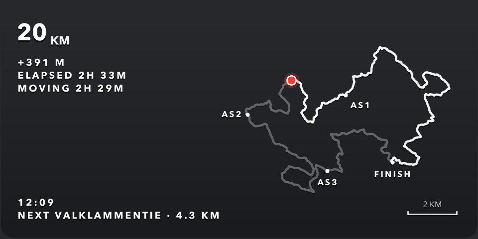
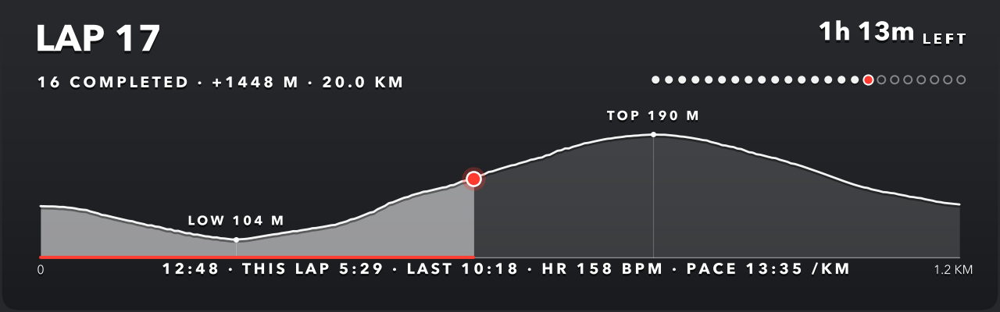

# race-overlay

**"You are here" overlays for race videos.** Parses your GPS activity file
(.fit / .gpx), draws the course — as an elevation profile, as a 2-D route
map, or as one loop of a lap race — with the event's checkpoints, and renders transparent PNGs showing
where on the course each moment — or each video clip — was filmed. Drop them
onto your footage in DaVinci Resolve (or any NLE); no keying needed. Works
for point-to-point and loop events: ultras, marathons, bike races.






*The actual PNGs have a fully transparent background — shown here on a dark
backdrop.*

Each overlay shows:

- the full course as an elevation profile or a route map (completed part
  emphasized, remaining part translucent) with checkpoint markers
- a "you are here" dot (+ progress bar on the profile, scale bar on the map)
- distance covered, elevation gained
- clock time, elapsed time, moving time
- distance to the next checkpoint
- optionally the current heart rate and pace (`--hr`, `--pace`), which
  makes most sense on the animated video overlays

All stats are computed for the exact position/moment of the overlay.

## Setup

Python 3.11+:

```bash
python -m venv .venv
.venv/bin/pip install -r requirements.txt
```

Describe your event in `event.toml` (checkpoint names + official kms, course
length, timezone, profile / map / laps view) — the committed file is a fully
documented example of a point-to-point event drawn as an elevation profile;
`events/nuuksio-classic-2026.toml` is a loop course drawn as a map and
`events/messila-vertical-2026.toml` a 4-hour lap race up and down a ski slope.

## Usage

**One overlay per video clip** (the main workflow) — reads each clip's
recording timestamp from its metadata and maps it onto your track:

```bash
python gopro_batch.py my_run.fit /path/to/clips extra_clip.MOV
```

Accepts folders and/or individual `.MP4`/`.MOV` files. iPhone footage carries
its own timezone; for other cameras set `camera.utc_offset_hours` in
`event.toml` to what the camera stamps into the file: a GoPro writes its
local clock (so use that clock's offset), a DJI Osmo Action writes UTC (use
0 — the local time is only in the file name). Camera clocks also drift by
seconds: if the overlay reacts late or early, find a clip where you
visibly stop or start, compare with the track (`--hr --pace` makes it
obvious), and put the difference in `camera.clock_behind_s`. Check two or
three clips — an aid station is ideal.

**Overlays for arbitrary positions** — km values, clock times, or a batch
file:

```bash
python race_overlay.py my_run.fit --km 34 57.5 88
python race_overlay.py my_run.fit --ts 09:30 --ts 14:02:30
python race_overlay.py my_run.fit --pos-file positions_example.txt
```

Useful flags (both scripts): `--view profile|map|laps`, `--width/--height/--dpi`
(default 1280×400 for the profile — ⅓ of a 4K frame width — and 960×480 for
the map; raise `--dpi` to scale the whole graphic), `--no-label`, `--no-time`,
`--event other.toml`, `--align checkpoints|linear|none`, `--hr` / `--pace`
(current heart rate and pace; pace combines the watch's distance, speed and
cadence channels so it reacts within a couple of seconds yet reads steadily,
and shows `--:--` while you stand), and
`--canvas 3840x2160 --anchor bottom-right` to pad each PNG to a transparent
full frame with the graphic flush in a corner (`--margin` adds a gap), so it
drops onto a timeline at zoom 1 with no positioning.

## Profile, map or laps

`view = "profile"` (default) draws distance on the x-axis with the terrain
above it — best for long point-to-point courses. `view = "map"` draws the
route seen from above with the stats in a column on the left — best for loop
courses, where a profile says little about *where* you are. On the map each
checkpoint takes an optional `label_pos` (compass point `n`/`ne`/…/`nw`) so
its label can be moved off the route line; `finish_label_pos` does the same
for the finish. Start and finish closer than 300 m count as a loop and get
one marker.

`view = "laps"` is for lap races — as many loops as you can in a time limit
(a "vertical" up and down a ski slope, a backyard-style loop), or a fixed
number of loops. It draws the elevation profile of **one** loop (the median
of all your laps) and the dot goes round it every lap, so you see where on
the hill each moment is. Around it: the lap in progress (`LAP 7`), the laps
that count so far, ascent and distance, one pip per lap, the time left
(`[laps] time_limit_h`; red for the last ten minutes), this and the previous
lap's time. Laps are found from the GPS track — every return to within
`start_radius_m` of where the recording started — not from the watch's lap
button, so a missed press does no harm. `late_lap_counts` says whether the
loop still in progress when the time runs out counts; if not, it is marked
`NOT COUNTED` (dimmed lap number, crossed pip, `+1:24 OVER`) from that moment
on while the completed count stands, and the final state reads e.g.
`23 LAPS · lap 24 finished 3:35 over`. No `total_km` is needed: distances
stay as recorded. If the ascent total is off on a short, sharp loop, tune
`event.gain_smooth_window_m` (default 100 m, calibrated on long courses).

**Placing them in DaVinci Resolve** — render with `--canvas <timeline size>
--mov` (needs ffmpeg) so each overlay is also an alpha video the length of
its clip, animated: the position and stats are re-rendered every
`--mov-step` seconds (default 2) of clip time, so a long clip keeps
counting down. Then `resolve_add_overlays.py` puts every clip's overlay on
its own video track at the clip's exact position and length.
Videos rather than stills because Resolve's API ignores the requested
length for a still image. The script has to run from inside Resolve
(Workspace > Scripts; the free edition allows no external scripting):
install a small launcher in Resolve's `Fusion/Scripts/Utility/` folder that
points at the script and your overlay folder — see the docstring. The
launcher's `MODE` is `replace` (every clip, track cleared first), `update`
(only re-place overlays that are already there, so ones you removed stay
removed) or `add` (only clips without one). To change just the look,
re-render the files in place and skip the script: Resolve reads them by
path.

## How the distance mapping works

GPS-recorded distance rarely matches the official course distance (drift,
corner-cutting, detours). Three alignment modes:

- **checkpoints** (default, most accurate): standstills are matched to the
  official checkpoint distances, giving a piecewise mapping that's accurate
  everywhere on the course. Standstills come from Garmin Ultra Run "rest"
  laps (near-standstill manual laps) when the FIT has them, otherwise from
  the track itself (30 s average speed under `rest_max_speed_ms` for at
  least `rest_min_duration_s`) — so it also works with plain run mode and
  GPX. Falls back to linear when nothing is detected.
- **linear**: uniformly rescales your track total to the official total.
- **none**: raw recorded distance.

Elevation gain is computed from distance-smoothed elevation so GPS jitter
doesn't inflate it (window tunable via `GAIN_SMOOTH_WINDOW_M`).

## Styling

Colors, fonts, sizes, opacities and the background scrim are constants at the
top of `race_overlay.py` (`MONO`, `ACCENT`, `SCRIM_MAX_ALPHA`, `FONT_STACK`,
...). The design defaults follow broadcast-overlay practice: monochrome
white + one accent color, soft shadows, subtle dark gradient scrim for
legibility over any footage.

## License

MIT
